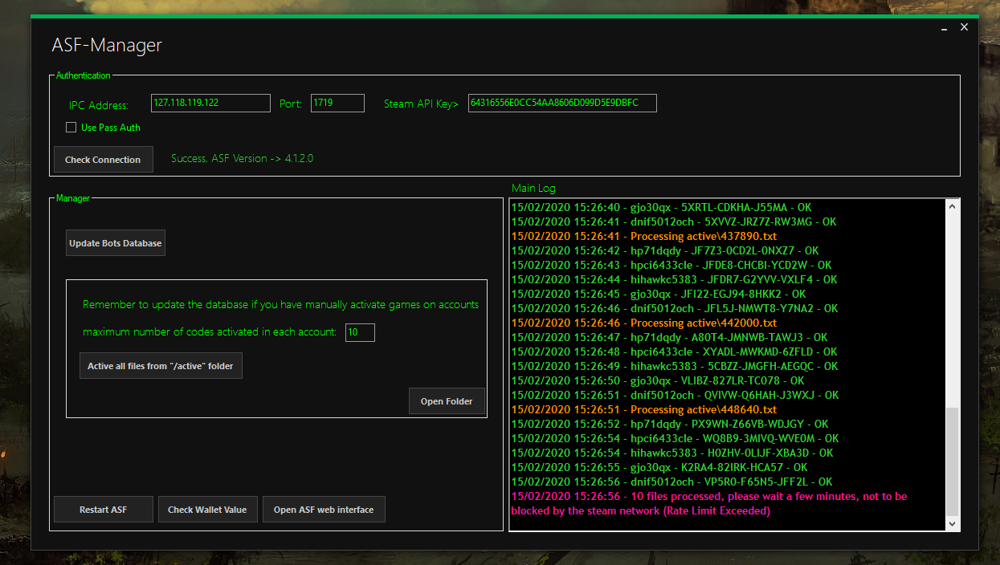

# ASF-Manager

---

## Description

C# GUI application to activate games on multiple accounts simultaneously

Application communicates directly with [ArchiSteamFarm](https://github.com/JustArchiNET/ArchiSteamFarm) through its API interface, checks which games the account does not have and automatically activates them

this project is still under development, some observations:

- Check Wallet function is not yet completed.
- I don't have much programming knowledge, I know that my code is poorly optimized, feel free to make improvements to the code!
